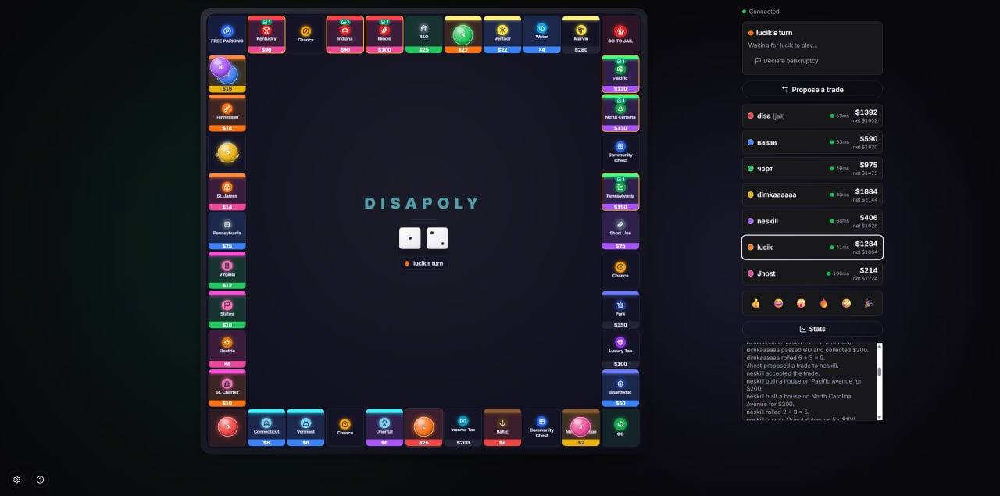

<div align="center">

# 🎲 Disapoly

**A browser-based take on Monopoly for playing with friends — no sign-up, no install.**

One person creates a room and shares a link. Everyone else joins, picks a nickname, and plays.

[**▶ Play now**](https://disapoly.pages.dev/) · [Architecture](architecture.md) · [Report a bug](https://github.com/oleksii-latyshev/disapoly/issues)

[](https://github.com/oleksii-latyshev/disapoly/actions/workflows/deploy.yml)




</div>

## ✨ Features

**Full classic rules** — nothing watered down:

- 🎯 Buying, rent, monopolies, houses & hotels with the even-building rule and a
  **finite building supply** (the classic house-shortage tactic works).
- 🔨 **Auctions** on declined or unaffordable properties, with live sequential
  bidding among all players.
- 🤝 **Trading** — properties, cash, and jail cards; multiple offers can be
  pending at once, with counter-offers. Allowed out of turn.
- 🃏 Chance & Community Chest, jail, mortgages, taxes, bankruptcy, win screen.

**Made for playing with friends online:**

- 🔗 **No accounts** — create a room, share the `?room=…` link, play. Identity
  survives refreshes; a dropped player can reconnect and resume.
- 🛡️ **Authoritative server** — the room lives in a Cloudflare Durable Object;
  clients only send intents, so nobody can cheat by editing state.
- ⏱️ Disconnect handling: skip an absent player's turn (manually or after a 30s
  grace period), auto-retire players gone for 5+ minutes, and pause when the
  room empties.
- 🖥️ **Hot-seat mode** — everyone on one device, no server needed.

**House rules & variety:**

- 🗺️ Two boards: the classic 40 tiles, or a **large 48-tile board** (10 street
  groups) built for 6–8 players.
- 💸 Pay modes: _turbo_ (instant collection) or _normal_ (settle debts yourself
  — sell, mortgage, or trade your way out before paying).
- 🎲 Optional opening roll-off for turn order.
- 🐇 **Surprise events** (optional): roughly every five minutes something
  unexpected happens — a bounty to race for, a lucky rabbit, golden dice,
  rent freezes and boom days, earthquakes that shake the whole board, money
  rain, jailbreaks, and tax audits — each with its own little animation.

**Polish you can feel:**

- 🎨 Three board themes (Classic / Minimal / Neon), icon-dominant tiles, and a
  3D-tilting board with animated tokens, dice, and card reveals — all gated by
  `prefers-reduced-motion`.
- 🔊 Fully **procedural sound design** (Web Audio — no audio assets): dice
  rattle, cash cha-ching, jail clang, win fanfare.
- 📈 Live net-worth chart, event callouts, emoji reactions, per-player
  connection quality, "your turn" tab notifications.
- 🌍 English and Russian, i18n across UI, game log, and cards.

## 🚀 Quick start

Prerequisites: [Bun](https://bun.sh) (and a free Cloudflare account for deploys).

```bash
bun install
bun run dev:party   # realtime room server (wrangler dev) → 127.0.0.1:8787
bun run dev         # client (Vite) → http://localhost:5173
```

Run both, open the client in two tabs (or devices), hit **Create online room**,
and share the `?room=…` link. Hot-seat mode is available straight from the home
screen and needs no server.

### Scripts

| Command                      | What it does                         |
| ---------------------------- | ------------------------------------ |
| `bun run dev` / `dev:party`  | Client / realtime server, locally    |
| `bun run test`               | Vitest unit tests for the game core  |
| `bun run typecheck` / `lint` | TypeScript / ESLint                  |
| `bun run deploy:all`         | Deploy worker + build + deploy Pages |

## 🏗️ How it's built

```
UI (React 19 + Tailwind 4 + Motion)  — renders state, dispatches intents
        │
Sync layer                            — online: WebSocket → Durable Object
        │                               hot-seat: local useReducer
Game core (pure TypeScript)           — (state, action) => state; seeded RNG,
                                        no React, no I/O — runs on both sides
```

The rules engine is a pure, deterministic reducer with a seedable PRNG, so the
exact same code runs in the browser (hot-seat) and inside the Cloudflare Worker
(online), and every match is reproducible. No database — a room's state lives in
its Durable Object and is dropped when the match ends.

Read the full design in [architecture.md](architecture.md).

## ☁️ Deploy

Pushes to `master` deploy automatically via GitHub Actions
([deploy.yml](.github/workflows/deploy.yml)): typecheck → lint → tests, then
`bun run deploy:all` (worker → client build → Pages). Both sides run on
Cloudflare's **free tier**.

One-time repo setup:

| Secret / variable                 | Value                                                             |
| --------------------------------- | ----------------------------------------------------------------- |
| `CLOUDFLARE_API_TOKEN`            | Token with **Workers Scripts: Edit** + **Cloudflare Pages: Edit** |
| `CLOUDFLARE_ACCOUNT_ID`           | Your Cloudflare account id                                        |
| `VITE_PARTYKIT_HOST` _(optional)_ | Worker host baked into the client build                           |

Manual deploy: `bun run deploy:all` (after `wrangler login`).

> [!WARNING]
> Durable Objects. UI-only changes need just `bun run build && bun run
deploy:pages`; redeploy the worker only when `src/game/**` changes.
